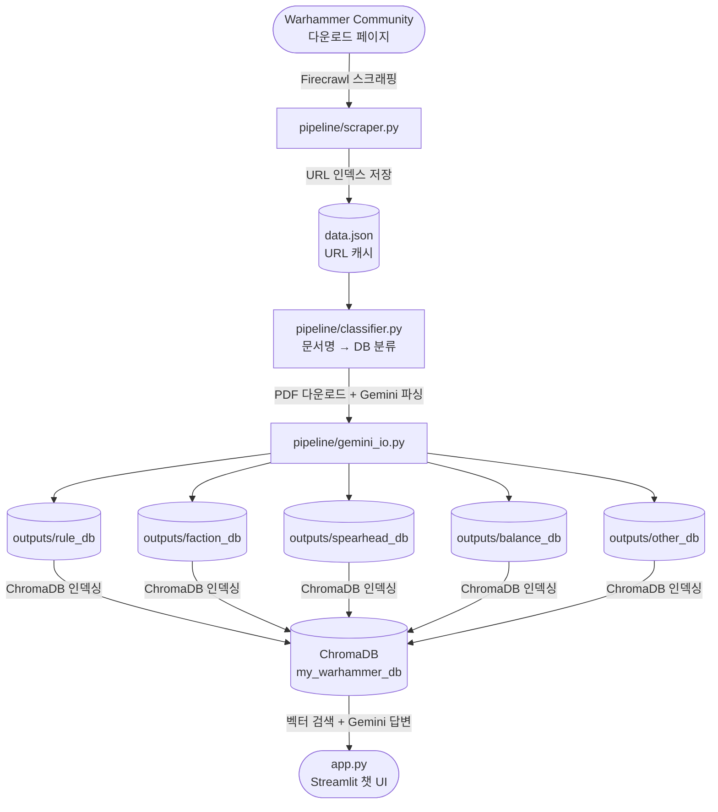

# Warhammer Age of Sigmar AI 룰마스터

워해머 에이지 오브 지그마 공식 PDF를 자동으로 수집·파싱하여 RAG 기반으로 규칙을 답변하는 AI 도우미입니다.

---

## 기획 의도

- 공식 다운로드 페이지의 **룰북·팩션 팩·스피어헤드·기란의 재앙** 등 PDF를 자동 수집
- Gemini로 PDF를 구조화된 JSON으로 파싱해 ChromaDB에 인덱싱
- 게임 플레이 중 자연어 질문으로 **규칙 해석·팩션 정보**를 즉시 조회
- 공식 문서 기반 답변으로 **할루시네이션을 줄이고** 출처를 함께 제공

---

## 아키텍처



---

## 프로젝트 구조

```
AoS_Chat/
├── app.py              # Streamlit 웹 앱 (RAG 채팅 UI)
├── main.py             # 전체 파이프라인 실행 진입점
├── runner.py           # 단일 문서 실행 (디버그용)
├── data.json           # PDF URL 인덱스 캐시 (스크래핑 결과)
│
├── core/               # 공용 모듈
│   ├── config.py           설정·상수·Gemini 프롬프트
│   ├── logging_config.py   로깅 설정 (컬러 콘솔 + 파일)
│   ├── retry.py            지수 백오프 재시도 로직
│   └── utils.py            경로·JSON·파일명 유틸리티
│
├── pipeline/           # 파이프라인 코어 로직
│   ├── classifier.py       문서명 → DB 분류 (rule/faction/spearhead/other)
│   ├── scraper.py          Firecrawl 스크래핑 및 캐시 관리
│   ├── gemini_io.py        PDF 다운로드 · Gemini 업로드 · JSON 추출
│   └── pipeline.py         오케스트레이션 (다운로드 → 파싱 → 저장)
│
├── outputs/            # 파싱된 JSON 결과물
│   ├── rule_db/            코어 룰 문서
│   ├── faction_db/         팩션 팩 (매치드 플레이)
│   ├── spearhead_db/       스피어헤드 문서
│   ├── balance_db/         배틀 프로필 (포인트)
│   └── other_db/           기란의 재앙 등 기타 문서
│
└── logs/               # 로그 파일 (자동 생성)
```

---

## 기술 스택

| 구분 | 기술 |
|------|------|
| PDF 파싱 | Google Gemini (`gemini-2.5-flash-lite`) |
| 벡터 DB | ChromaDB (cosine 유사도) |
| 임베딩 | SentenceTransformer (`paraphrase-multilingual-MiniLM-L12-v2`) |
| 스크래핑 | Firecrawl |
| 웹 UI | Streamlit |
| LLM 답변 | Google Gemini (`gemini-2.5-flash`) |

---

## 설치 및 설정

### 1. 의존성 설치

```bash
python -m venv .venv
source .venv/bin/activate   # Windows: .venv\Scripts\activate

pip install streamlit chromadb sentence-transformers google-genai \
            python-dotenv firecrawl-py requests
```

### 2. 환경 변수

프로젝트 루트에 `.env` 파일을 생성합니다.

```env
GEMINI_API_KEY=your_gemini_api_key
FIRECRAWL_API_KEY=your_firecrawl_api_key
```

- **GEMINI_API_KEY**: [Google AI Studio](https://aistudio.google.com/) 에서 발급
- **FIRECRAWL_API_KEY**: [Firecrawl](https://firecrawl.dev/) 에서 발급

---

## 실행 방법

### 1단계: PDF 파싱 및 JSON 저장

```bash
# 전체 문서 처리 (data.json 캐시 재사용)
python main.py

# 분류 요약만 확인 (API 호출 없음)
python main.py --dry-run

# 특정 섹션만 처리
python main.py --section "Spearhead"
python main.py --section "Faction Packs"

# 웹에서 PDF 목록 재스크래핑 후 전체 처리
python main.py --force-scrape
```

> 결과는 `outputs/<db_name>/` 아래에 JSON 파일로 저장됩니다.

단일 문서만 처리하려면 (디버그):

```bash
python runner.py --keyword "Lumineth Realm-lords"
```

### 2단계: 웹 앱 실행

```bash
streamlit run app.py
```

브라우저 채팅창에서 규칙·팩션 관련 질문을 입력하면 RAG 기반으로 답변과 출처가 표시됩니다.

---

## DB 분류 기준

`pipeline/classifier.py`에서 문서명을 기준으로 자동 분류합니다.

| DB | 분류 조건 (문서명 키워드) |
|----|--------------------------|
| `rule_db` | Core Rules, Rules Updates, Glossary |
| `balance_db` | Battle Profiles |
| `faction_db` | Faction Pack: |
| `spearhead_db` | Spearhead (Reference/Doubles → 코어 룰, 나머지 → 팩션 룰) |
| `other_db` | Scourge of Ghyran |

---

## 로그

콘솔은 레벨별 컬러로 출력되며, `logs/aos_chat.log`에 파일로도 저장됩니다.

```
환경 변수 AOS_LOG_LEVEL=DEBUG  로 레벨 변경 가능 (기본: INFO)
```

---

## TODO

| # | 단계 | 태스크 | 설명 | 공수 | 상태 | 우선순위 |
|---|------|--------|------|------|------|----------|
| 1-1 | 기획 및 설계 | 유스케이스 정의 | 워해머 4판 룰 심판 페르소나 및 목적 정의 | 1 MD | ✅ 완료 | 높음 |
| 1-2 | 기획 및 설계 | 아키텍처 설계 | 로컬 RAG 파이프라인 및 모듈 구조 설계 | 2 MD | ✅ 완료 | 높음 |
| 2-1 | 데이터 파이프라인 | 데이터 소스 수집 | Firecrawl을 활용한 PDF 다운로드 링크 스크래핑 | 2 MD | ✅ 완료 | 높음 |
| 2-2 | 데이터 파이프라인 | 데이터 파싱 | Gemini API를 활용한 PDF 구조화 및 텍스트 추출 | 3 MD | ✅ 완료 | 높음 |
| 2-3 | 데이터 파이프라인 | 데이터 정규화 | 파이썬 스크립트를 통한 JSON 스키마 통일 및 분리 | 2 MD | ✅ 완료 | 높음 |
| 3-1 | 벡터 DB 및 검색 | 청킹 전략 수립 | 유닛 워스크롤 및 룰 단위의 의미론적 분할 기준 마련 | 1 MD | 🔄 진행 중 | 높음 |
| 3-2 | 벡터 DB 및 검색 | 임베딩 및 적재 | 텍스트 임베딩 모델 선정 및 ChromaDB 컬렉션 구축 | 2 MD | ⏳ 대기 | 높음 |
| 3-3 | 벡터 DB 및 검색 | 검색 로직 구현 | 메타데이터 기반 필터링 및 하이브리드 검색 구현 | 3 MD | ⏳ 대기 | 높음 |
| 4-1 | LLM 연동 | 모델 선정 및 프롬프트 | 답변 생성을 위한 LLM 설정 및 시스템 프롬프트 작성 | 2 MD | ⏳ 대기 | 중간 |
| 4-2 | LLM 연동 | 할루시네이션 통제 | 코어 룰 및 패치 내역 우선순위 적용 규칙 설정 | 3 MD | ⏳ 대기 | 중간 |
| 5-1 | 인터페이스 개발 | 백엔드/프론트엔드 구축 | Streamlit을 활용한 챗봇 UI 및 질의응답 서버 구현 | 3 MD | ⏳ 대기 | 중간 |
| 5-2 | 인터페이스 개발 | 대화 메모리 적용 | 이전 질문의 맥락을 기억하는 세션 관리 기능 추가 | 2 MD | ⏳ 대기 | 낮음 |
| 6-1 | 평가 및 배포 | RAG 성능 평가 | 검색 정확도 및 답변 품질 테스트 | 3 MD | ⏳ 대기 | 중간 |
| 6-2 | 평가 및 배포 | 시스템 배포 | 로컬 또는 클라우드 환경에 시스템 릴리즈 | 2 MD | ⏳ 대기 | 낮음 |

---

## 데이터 출처

규칙 PDF는 [Warhammer Community - Age of Sigmar Downloads](https://www.warhammer-community.com/en-gb/downloads/warhammer-age-of-sigmar/) 페이지에서 수집됩니다.
개인·로컬 활용 목적의 인덱싱이며 상업적 재배포가 아닙니다.

---

## 면책 사항

이 프로젝트는 Games Workshop의 공식 제품이 아닙니다.
규칙 해석은 참고용이며, 공식 토너먼트·판정은 반드시 공식 룰북과 GW 공지를 따르세요.
